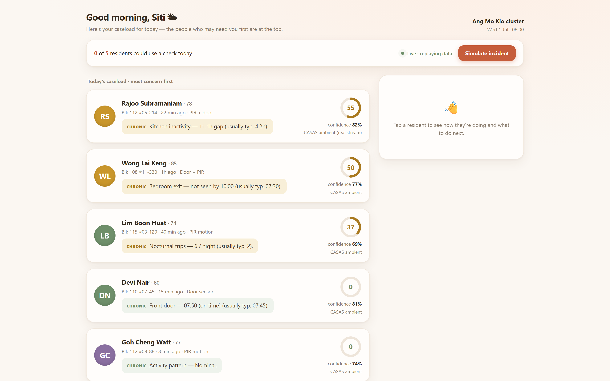
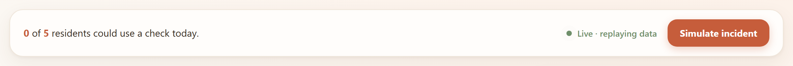
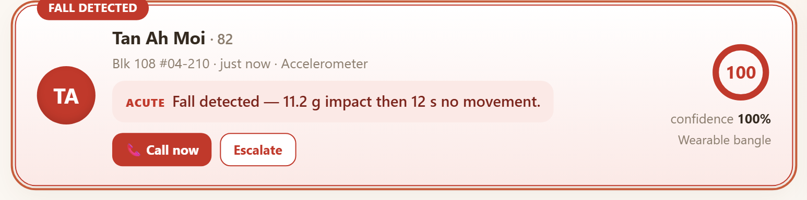
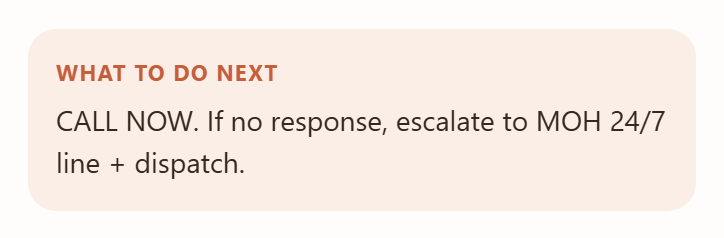
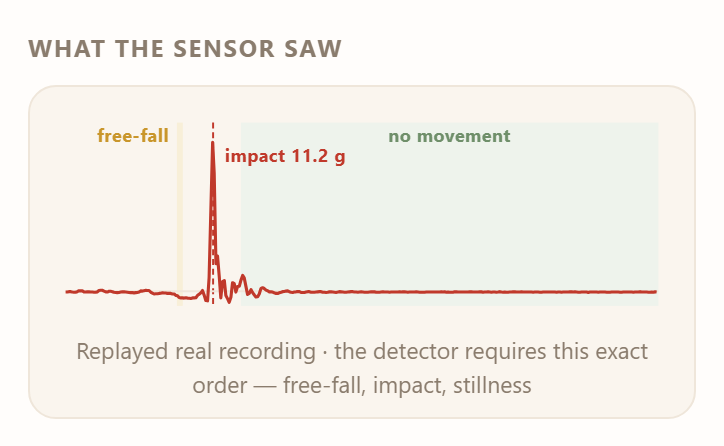
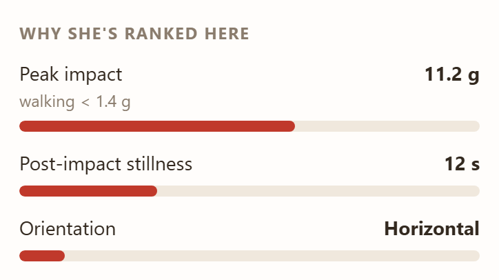
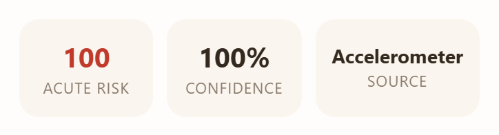
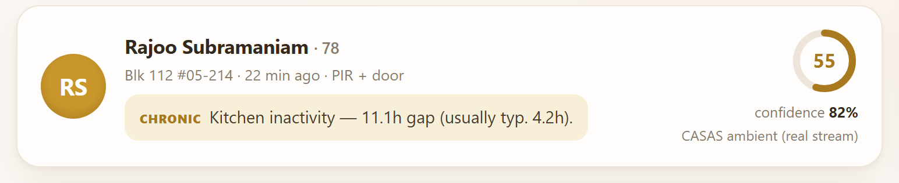
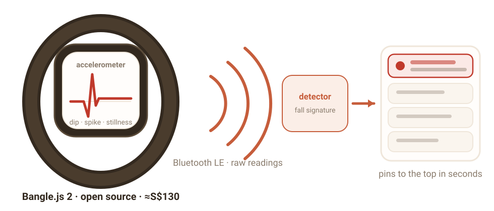

<!-- _class: title -->

###### JSGP · SHINE Hackathon

# Morning **Triage**

The morning triage for One Care caseworkers:
who needs you first, and why, in plain language.

---

<!-- _class: statement -->

###### The problem

# Help that must be **asked for**

Alarm buttons and pendants only help while the fallen person
can still press them. An unconscious senior presses nothing.

The fall becomes a **long lie**: hours helpless on the floor
before anyone thinks to check.

---

<!-- _class: statement -->

###### The insight

# The home **already knows**

Routine is a vital sign, and absence of motion is data.
The ambient track asks the senior to wear nothing, press nothing,
and puts no camera in the room.

One optional bangle adds a second layer:
falls caught in seconds instead of hours.

*All of it is off-the-shelf hardware, and Singapore already
deploys senior alert wearables at 26,800-resident scale.*

---

###### The product

# One screen, **calm by default**

*Every resident is ranked by need, and every row explains itself in one sentence.*

---

###### The demo beat

# A fall **preempts everything**

<figure>

<figcaption>The button replays a real recorded fall through the live detector, the same signal a worn bangle would stream</figcaption>
</figure>

<figure>

<figcaption>The fall pins to the top in seconds and states its evidence in plain words</figcaption>
</figure>
<figure>

<figcaption>The system suggests the next step. The caseworker makes the call</figcaption>
</figure>

---

###### How it works

# A fall has a **signature**

<figure>

<figcaption>Straight from the product: the drill-down shows the signal behind every incident</figcaption>
</figure>

The detector requires this **ordered sequence**: a free-fall dip, an impact
spike within half a second, then stillness. A dropped phone cannot fake the order.

---

###### Explainable by contract

# Every number **decomposes**

<figure>

<figcaption>Every score breaks into the sensor facts that produced it. Nothing is taken on faith</figcaption>
</figure>
<figure>

<figcaption>A stale sensor lowers confidence. It never inflates risk, so a dead sensor cannot fake a crisis</figcaption>

The system ranks and explains.
**A human decides.**

</figure>

---

###### Validated on real data

# It's **real**, not a concept

<b>96.2%</b>of 1,798 real falls detected · SisFall

<b>29.8% → 0–5%</b>lab alarms → elderly-typical movement

<b>220 days</b>one real home · CASAS Aruba

Nothing is trained. The thresholds were calibrated openly on the full SisFall set,
and the lab false alarms concentrate in jogging and jumping, movements a
monitored senior rarely performs.

<figure>

<figcaption>Rank 1 carries 220 real days of one elderly resident. The system found the broken day on its own</figcaption>
</figure>

---

###### Built for Singapore

# No imported **prior**

- **Self-baselining.** The system measures each resident's own kitchen gaps, door times and night trips for about two weeks, then flags deviation from that person's own normal.
- **Presence-only dignity.** Seniors accept what does not watch them.
- **Per-HDB deployment.** An installer fills in a one-page sensor map. The product multiplies One Care's existing people and replaces no one.

---

###### Honest limits

# What we **don't** claim

- It shrinks time to detection. It does not promise to catch every event.
- Fall thresholds were calibrated on mostly young-adult recordings, so the senior false-alarm rate is extrapolated rather than measured.
- A missed fall (or a bangle left on the nightstand) degrades to the ambient track, where hours of stillness still surface that resident by morning.
- An irregular life earns wide baselines. The system says so through *low confidence* instead of hiding it.

---

###### Beyond the PoC

# From demo to **pilot**

- **Escalation that completes the loop.** Automated welfare calls, and a handoff to the MOH/AIC line when a fall goes unacknowledged.
- **A morning brief per flagged resident.** Auto-drafted wording, grounded strictly in the deterministic features. The drafting layer never touches a score.
- **One One Care cluster to start.** Measure time to detection and caseworker minutes saved per shift.

---

<!-- _class: statement -->

###### The ask

# Pilot **with us**

One cluster. Commodity sensors. A working system,
validated on **4,505 real recordings** and a **220-day real home**.

*Built at SHINE Hackathon. The demo runs live, replaying real recordings.*

---

###### Backup · for Q&A

# The three **layers**

*The home senses. The service scores. The caseworker decides.*

---

###### Backup · for Q&A

# Why **no machine learning**

- **No Singapore training data exists.** A model trained on Colombian or American recordings would import exactly the prior we refuse to assume.
- **A fall is physics.** The free-fall, impact and stillness sequence transfers across bodies and homes without any training step.
- **A caseworker must be able to ask why.** Decomposable rules survive that question. A black box does not.
- Where a model helps later: smoothing the wording of the morning brief. It will never produce a score.

---

###### Backup · for Q&A

# Where the **data goes**

| Dataset | Role in the system |
|---|---|
| **SisFall** · Universidad de Antioquia · 4,505 recordings, 1,798 real falls | Calibrates the fall thresholds, measures the detector, and supplies the live demo trace |
| **CASAS Aruba** · Washington State University · 220 days of one elderly resident's home | Validates that self-baselining recovers a real routine, and finds the day it broke |

Nothing is trained on either dataset. Both are provenance-pinned with
checksums in a committed lock file, and every number reproduces from one script.

---

###### Backup · for Q&A

# From a fall to the **dashboard**

The path is the same in the demo and in deployment. Only the source of
the signal changes.

1. The bangle streams accelerometer readings to the scoring service.
2. The detector watches every reading for the ordered fall signature:
   dip, spike, stillness.
3. A detection pushes an incident event down a live stream the dashboard
   is always listening to. The resident pins to the top in seconds.

*Step 1 is the one link we simulate; there is no wristband in the room.
The Simulate button feeds a real recorded SisFall trace straight into step 2,
and everything after (detection, push, re-rank) is the production path.*

---

###### Backup · for Q&A

# The hardware **exists today**

| Device | Real product, buyable now | Price |
|---|---|---|
| Wearable: raw accelerometer, BLE | **Bangle.js 2**, Kionix KX022, open firmware | ≈S$130 |
| Room presence · door events | **Aqara P1** motion · contact, 5-yr battery | ≈US$20 · 15 |
| Singapore precedent | **GovTech WAAS** (iWOW, 2025): 170 blocks · 26,800 seniors | govt tender |

---

###### Backup · for Q&A

# What a flat **needs**

- Motion sensors in the rooms that carry routine: kitchen, bedroom, bathroom, living room.
- One contact sensor on the front door.
- One optional bangle for the acute track. The routine track works with nothing worn at all.
- An installer fills in a one-page sensor-to-area map. No cameras, no microphones, no rewiring.
