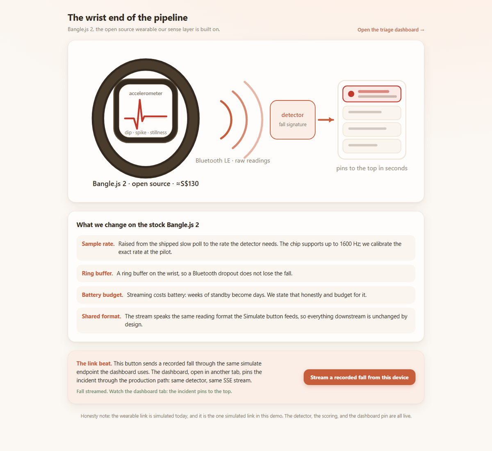

<!-- _class: title -->

###### JSGP · SHINE Hackathon

# Morning **Triage**

The morning triage for One Care caseworkers:
who needs you first, and why, in plain language.

---

<!-- _class: statement -->

###### The problem

# Help that must be **asked for**

Alarm buttons and pendants only help while the fallen person
can still press them. An unconscious senior presses nothing.

The fall becomes a **long lie**: hours helpless on the floor
before anyone thinks to check.

---

<!-- _class: statement -->

###### The approach

# Help that needs **no button**

Motion and door sensors log every kitchen visit and every door event.
When a morning breaks that pattern, or hours pass with no movement at all,
the resident surfaces on the caseload. Nothing worn, nothing pressed,
and no camera in the room.

One optional bangle adds a second layer:
falls caught in seconds instead of hours.

*All of it is off-the-shelf hardware, and Singapore already
deploys senior alert wearables at 26,800-resident scale.*

---

###### The two datasets

# Why these two **recordings**

<b>4,505</b>real recordings · 1,798 falls · 38 people · SisFall

<b>220 days</b>one senior, living alone · CASAS Aruba

*One teaches the detector what a fall is in physics.
The other teaches the system what one person's normal life is in rhythm.*

Both run on the same cheap sensor class a worn bangle carries, the **ADXL345**
accelerometer, so what the detector sees in the data is what it would see in a home.
Both are checksum-pinned in a committed lock file, and every number reproduces
from one script.

<!--
SisFall and CASAS do two different jobs. SisFall gives us 4,505 real recordings, 1,798
of them genuine falls, from 38 different people, sensors strapped to real bodies hitting
real floors. It was recorded on the ADXL345, the same cheap accelerometer class a worn
bangle carries, so the detector learns to see exactly what it would see in a real home.
CASAS Aruba covers 220 days, roughly seven months, of one real elderly person living
alone, with every motion sensor and every door event logged. SisFall teaches the detector
what a fall is in physics: the dip, the impact, the stillness. CASAS teaches the system
what one person's ordinary life is in rhythm, so it can notice the morning that rhythm
breaks. No third dataset would add what these two do not already carry. The two tracks
stay separate all the way down: the calibration you are about to see only ever touches
SisFall. CASAS is never tuned against a target. From those 220 days we compute each
resident's own baseline and score every new day as a deviation from that person's rhythm,
so the routine track learns without any training and without any population average.
-->

---

###### How it works

# A fall has a **signature**

<figure>

<figcaption>Straight from the product: the drill-down shows the signal behind every incident</figcaption>
</figure>

The detector requires this **ordered sequence**: a free-fall dip, an impact
spike within half a second, then stillness. A dropped phone cannot fake the order.

<!--
The signal drops toward zero first: free-fall, the half-second the body falls with
nothing holding it up. Then the spike: the impact with the floor. Then it goes flat and
stays flat: stillness. Free-fall, impact, stillness, in that order. A dropped phone has
the dip and the spike, but it gets picked up, so the stillness never comes. The detector
checks the sequence, so a slammed door or a bag set down hard cannot fake it.
-->

---

###### What the numbers say

# We measured it on **all 4,505**

<b>96.2%</b>of 1,798 real falls detected · SisFall

<b>18.8%</b>false alarms on elderly movement · half the young-adult rate

We swept **144** threshold combinations over all 4,505 recordings and kept the
best trade-off. Nothing was filtered out, and nothing was trained: the numbers
come from counting an experiment.

*Elderly falls came in at 84.0%, all 75 from a single volunteer,
so we hold that figure lightly.*

<!--
The 96.2 percent comes from counting an experiment rather than from a claim. We wrote the
detector first: free-fall dip, then impact, then stillness, in that order. We ran it over
all 4,505 recordings and counted, then swept 144 threshold combinations, four free-fall
cutoffs, four impact cutoffs, three dip durations, three impact windows, and kept the
operating point at the knee: free-fall below 0.8 g, impact above 2.3 g, a dip of at least
40 ms, impact within 500 ms. Nothing was filtered or sorted out of the set. We were never
learning a population, we were measuring a detector against physics, and physics is the
same in Jurong as in a lab in Antioquia, so it carries with no local training data.
Each of the three numbers answers a different worry. The 96.2 percent of 1,798 real falls
is the detector catching the thing it exists to catch. The middle number is false alarms.
On young adults throwing themselves into lab falls it fires 35.2 percent of the time;
split the recordings by body and re-count the elderly participants alone, and it fires
18.8 percent, roughly half. That is a measurement rather than a hope: older movement is slower
and less abrupt, so it trips the detector less often. The one number we hold lightly is
elderly falls: 84.0 percent caught, but those 75 falls all come from a single volunteer,
the only elderly participant cleared to fall on camera, so it is a real number from a thin
sample and we say so. The 220 days on the right is the other track: one real home where
the system found the broken day by itself. That track runs on a different mechanism: from
those 220 days it builds the resident's own baseline and scores each new day as a
deviation from that rhythm, so it needs no training run and no population average to know
that this morning broke this person's pattern.
-->

---

###### The other half of the caseload

# 220 days taught us **his normal**

<figure>

<figcaption>Straight from the product: rank 1 carries the 220 real days. The system found the broken day on its own</figcaption>
</figure>

The **routine track** ranks the calm caseload. From 220 days of one real home it
learned that resident's own rhythm: when the kitchen first wakes, how many night
trips, when the door first opens. On **2011-02-19**, a date inside that recording,
the rhythm broke, and the system pushed him to **rank 1 (0.65)** on its own. We
never marked that day. No training, no population average: his history is the baseline.

<!--
This is the half of the product that is not about falls. The routine track ranks the
calm caseload, and it works by self-baselining: from 220 days of one real CASAS home
the system learns that resident's own rhythm, when the kitchen first wakes, how many
night trips he makes, when the front door first opens. Then it scores every new day
as a deviation from that rhythm. We handed it the 220 days and asked it to find the
day the routine broke. It picked 2011-02-19, a date inside the historical recording:
a 16-hour kitchen gap, an early door, fewer night trips. We never marked that day as
anomalous. There is no training run and no population average anywhere in this track;
the resident's own history is the baseline, which is why it carries to Singapore
unchanged. This same track is also the safety net: a fall the bangle or the camera
misses still surfaces the slow way, because hours of stillness push that resident up
this ranking by morning.
-->

---

###### The counter-experiment

# We trained a model **anyway**

**The gap is the finding.** The model tops out at **80.0%**; the shipped detector
reads the same physics at **96.2%**. The 16.2-point gap is the evidence that the
temporal order, free-fall then impact then stillness, is what magnitudes alone cannot see.

- We fit a logistic regression on **500** real SisFall recordings, four magnitude features each. **250 falls and 250 ordinary activities on purpose**: an even table keeps accuracy readable at face value, and the committed table re-runs the experiment offline on any machine.
- On the held-out **125** recordings: 80.0% accuracy, 77.9% precision, 84.1% recall. Re-splits move it only 78.5 to 80.0%, and growing the training slice from 38 to 375 recordings moves it only 78.4 to 80.0%: **the size is not the ceiling, the features are.**
- One fit takes **0.050 seconds**, so the `/training` page replays the real recorded run live.

<!--
The obvious question is why we did not train a model, so we trained one and put the whole
run on the /training page, "How the model was trained". The table is built by the same
loaders and the same detector code the live service runs, so every row is a real
recording, nothing resampled. Both numbers in "500" are deliberate. The balance: SisFall
is 1,798 falls against 2,707 ordinary activities, and a model fit on that imbalance can
score well by leaning toward the majority class, so we evened the classes at 250 each to
keep accuracy readable at face value. The size: the table is committed to the repository
at a few hundred kilobytes, so a fresh clone re-runs the whole experiment offline and
reproduces every number to the digit. And we checked 500 is enough before settling on it.
On the held-out 125 recordings the model reaches 80.0 percent accuracy, 77.9 percent
precision and 84.1 percent recall. We re-fit at 60/40, 70/30 and 80/20 splits and accuracy
only moves between 78.5 and 80.0 percent; we re-fit on growing slices from 38 to 375
recordings and it moves between 78.4 and 80.0. If 337 more recordings buy 1.6 points,
4,000 more will not close a 16.2-point gap. The ceiling is a property of the features
rather than of the sample. One fit takes 0.050 seconds, which is why the page can replay the actual recorded
gradient-descent run in front of you; every number on it is measured, nothing is
simulated. The shipped detector reaches 96.2 percent on the same physics because it reads
the order of events, the free-fall, then the impact, then the stillness. The 16.2-point
gap is the evidence that the temporal order is what magnitudes alone cannot see. Nothing
on this page ever scores a resident.
-->

---

###### The product

# One screen, **calm by default**

*Every resident is ranked by need, and every row explains itself in one sentence.*

---

###### Explainable by contract

# Every number **decomposes**

<figure>

<figcaption>Every score breaks into the sensor facts that produced it. Nothing is taken on faith</figcaption>
</figure>
<figure>

<figcaption>A stale sensor lowers confidence. It never inflates risk, so a dead sensor cannot fake a crisis</figcaption>

The system ranks and explains.
**A human decides.**

</figure>

---

###### Then we added a second acute source

# The camera knows a fall from a **lie-down**

- **A camera catches the fall the bangle misses**: left on the nightstand, or never worn. Pose estimation runs entirely in the browser on `/watch`; upright, then horizontal within **3.5 s**, then **3 s** of stillness fires the same alert as the bangle. A slower transition is a deliberate lie-down and never alarms.
- Camera incidents carry the label **Camera (pose)** and the heuristic's own 0.55 to 0.85 confidence band. The 96.2% figure belongs to the accelerometer track alone.
- Enrolled face identity is opt-in and on-device, so the caseload row and the alert are **named** and say where to look: *last motion: Bedroom*. Unmatched people fire the generic alert; no video leaves the browser. A fall sends a **stick-figure joint trace**, and the drilldown replays how the fall happened: *fell rightward, 1.9 s descent, hard impact, no arm protection*.

<!--
The camera is the second acute source, and it is opt-in. MediaPipe pose runs entirely in
the browser; no frame leaves the device. Upright, then horizontal within 3.5 seconds, then
3 seconds of stillness fires the same incident path as the bangle. A slower transition is
a deliberate lie-down and never alarms. After a confirmed fall the browser also sends a
fifteen-second stick-figure trace, joint coordinates and never pixels, and the drilldown
replays it: descent time, fall direction, impact severity, whether the arms came out. The honesty rules
hold: the incident is labelled
Camera (pose) with the heuristic's own confidence band, never the 96.2 percent, which
belongs to the accelerometer track. Identity is enrolled on-device: front, left and right
angles stored as embeddings in the browser, no image kept and no face ever sent. Matching runs
only while the person is upright and the binding carries the name through the fall, so the
row and the ping are named, and the alert adds the resident's last-motion area from the
ambient track. Unmatched people fire the generic alert, because recognition can never
block or alter an alert.
-->

---

###### Then we closed the loop

# The alert **answers back**

- A detected fall sends a **named** Telegram alert: who fell, the unit, and the last-motion area to check first.
- **No recovery within 45 s sends STILL DOWN.** Standing up cancels it, and it fires once per fall.
- A caregiver taps **I am responding**: the alert is stamped with who took it, the first tap wins, and the dashboard shows the name within 5 seconds.
- With no bot configured the alert leg quietly does nothing. Detection never waits on it.

<!--
The alert leg is the part most systems leave silent, so we built it to answer back. A
detected fall sends a named Telegram alert with the unit and the last-motion area, so the
caregiver knows who, where, and which room to check first. Then the long lie, the problem
we started from: if nobody rises 45 seconds after the alert, a STILL DOWN message follows.
Standing up cancels it, and it fires once per fall. The button closes the loop the other
way: a caregiver taps I am responding, the alert message itself is stamped with who took
it, the first tap wins so the group always sees one owner, and the dashboard badge shows
the name within 5 seconds. /alerts/status reports whether Telegram is configured and how
the last dispatch ended, so a silent alert leg is impossible. And with no token configured
the whole leg is a safe no-op: detection never waits on a notification. The path is
covered by 96 backend and 25 frontend tests, all passing.
-->

---

###### The demo beat

# A fall **preempts everything**

<figure>

<figcaption>Each press streams a different real recorded fall through the live detector, the same signal a worn bangle would send. A second button injects a dropped phone the detector ignores</figcaption>
</figure>

<figure>

<figcaption>The fall pins to the top in seconds and states its evidence in plain words</figcaption>
</figure>
<figure>

<figcaption>The system suggests the next step. The caseworker makes the call</figcaption>
</figure>

*The camera and the alert loop you just saw run live too: `/watch` and the
Telegram ping are the same incident path. `/training` replays the trained-model run.*

---

###### Honest limits

# What we do **not** claim

- It shrinks time to detection. It does not promise to catch every event.
- The senior false-alarm rate is **measured** rather than guessed, because it came in at 18.8% on real elderly recordings, lower than young adults. What stays thin is elderly *fall* data, since our falls come from one volunteer, and a lab fall is not the same as a home fall.
- A missed fall (or a bangle left on the nightstand) degrades to the routine track, where hours of stillness still surface that resident by morning.
- An irregular life earns wide baselines. The system says so through *low confidence* instead of hiding it.

<!--
Here is what we deliberately do not claim. We shrink time to detection; we do not promise
to catch every event, and any deck that promises that is lying. The second line used to
say our senior false-alarm rate was extrapolated from young adults. We measured it
directly on the elderly recordings at 18.8 percent, lower than the young adults, and
corrected the slide rather than let a flattering guess stand. The honest gap runs the
other direction: elderly fall data is thin. All our elderly falls come from one volunteer,
and a fall staged in a lab is not a fall in a real kitchen. We name that caveat rather than
paper over it. The last two lines are the safety net: a missed fall, or a bangle left on
the nightstand, drops to the ambient track, where hours of stillness still surface that
person by morning; and an irregular life earns a wide baseline, which the system reports
through low confidence instead of hiding.
-->

---

###### The next step

# What a pilot would **prove**

- **Escalation beyond the app.** The STILL DOWN follow-up and the I-am-responding acknowledgement are built and live. A pilot adds what sits past the phone: automated welfare calls, and the handoff to the MOH/AIC line when nobody acknowledges.
- **A morning brief per flagged resident.** Auto-drafted wording, grounded strictly in the deterministic features. The drafting layer never touches a score.
- **A single One Care cluster to start.** Measured on two numbers: time to detection, and caseworker minutes saved per shift.

---

<!-- _class: statement -->

###### The ask

# Pilot **with us**

We ask for one cluster and commodity sensors. The working system
is already validated on **4,505 real recordings** and a **220-day real home**.

*Built at SHINE Hackathon. The demo runs live on real recordings, a different one each press.*

---

###### Backup · for Q&A

# Why **no machine learning**

- **No Singapore training data exists.** A model trained on Colombian or American recordings would import exactly the prior we refuse to assume.
- **A fall is physics.** The free-fall, impact and stillness sequence transfers across bodies and homes without any training step.
- **A caseworker must be able to ask why.** Decomposable rules survive that question. A black box does not.
- Where a model helps later: smoothing the wording of the morning brief. It will never produce a score.

---

###### Backup · for Q&A

# The three **layers**

*The home senses. The service scores. The caseworker decides.*

*The math is Python, so the service computes and the browser only displays. The API call carries the JSON between them.*

<!--
Why two processes and not one? The scoring is Python: the detector, the calibration, and the dataset loaders, all built on numpy and scipy. The browser runs JavaScript and cannot run that math. So the service computes the numbers and returns them as JSON, and the browser only displays them. The API call is the browser asking the service for the scores it cannot compute itself.
-->

---

###### Backup · for Q&A

# From a fall to the **dashboard**

The path is the same in the demo and in deployment. Only the source of
the signal changes.

1. The bangle streams accelerometer readings to the scoring service.
2. The detector watches every reading for the ordered fall signature:
   dip, spike, stillness.
3. A detection pushes an incident event down a live stream the dashboard
   is always listening to. The resident pins to the top in seconds.

*Step 1 is the one link we simulate; there is no wristband in the room.
Each press of the Simulate button feeds a different real SisFall trace straight into
step 2; a second button injects a dropped phone the detector ignores. Everything after
(detection, push, re-rank) is the production path.*

---

###### Backup · for Q&A

# The hardware **exists today**

<figure>

</figure>
<figure>

<figcaption>Live in the dashboard today: /hardware streams a recorded fall through the production path</figcaption>
</figure>

| Device | Real product, buyable now | Price |
|---|---|---|
| Wearable: raw accelerometer, BLE | **Bangle.js 2**, Kionix KX022, open firmware | ≈S$130 |
| Room presence · door events | **Aqara P1** motion · contact, 5-yr battery | ≈US$20 · 15 |
| Singapore precedent | **GovTech WAAS** (iWOW, 2025): 170 blocks · 26,800 seniors | govt tender |

---

###### Backup · for Q&A

# What a flat **needs**

- Motion sensors in the rooms that carry routine: kitchen, bedroom, bathroom, living room.
- One contact sensor on the front door.
- One optional bangle for the acute track. The routine track works with nothing worn at all.
- An installer fills in a one-page sensor-to-area map. No cameras, no microphones, no rewiring.
