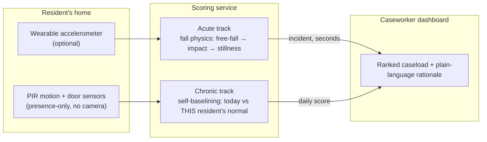

# Morning Triage — Solution Overview

> **Who this page is for.** Judges, partners, and anyone who wants the
> product story without the engineering internals. The deep technical tiers
> ([[backend-architecture]], [[feature-spec]], the ADRs) sit underneath this
> page and every claim here traces into them.

## The problem (JSGP problem statement)

> How might we better enable seniors and persons with disabilities to live
> independently, confidently and meaningfully within their homes and
> communities?

**The gap.** Despite community support networks like One Care @ Jurong
Spring, Singapore's safety net for isolated elderly residents is **entirely
reactive**: wall-mounted alarm buttons and wearables that fail precisely when
they're needed most — when a senior is unconscious, or too incapacitated to
press anything. No real-time visibility means a fall can become a long lie:
hours helpless on the floor, avoidable hospitalisation, and a high share of
injury-related deaths.

## Our answer, in one sentence

**A morning triage dashboard that tells a One Care caseworker — before their
first coffee — which of their residents needs them first, and why, in plain
language.**

The senior presses nothing, wears nothing new, and is never on camera. The
home's ambient sensors (motion, door) and an optional wearable notice two
things a human network can't watch for at scale:

- **Acute:** the physics of a fall — free-fall, impact, then stillness —
  detected in seconds and pushed live to the top of the caseload.
- **Chronic:** a routine quietly breaking — the kitchen unused all morning,
  night bathroom trips changing — scored against **that resident's own
  normal**, not anyone else's.

## What the product looks like

*(Screenshots to be captured from the running PoC — see [[slide-plan]] asset
list.)*

1. **The caseload** — every monitored resident, ranked by need. Calm by
   default: most rows are "Nominal". Each elevated row states its reason in
   one sentence: *"Kitchen inactivity — 11.1h gap (usually typ. 4.2h)."*
2. **The drill-down** — click a resident and every number decomposes: which
   signal, how unusual, how much it contributed, how confident the system is.
   No black box anywhere between sensor and caseworker.
3. **The incident beat** — when a fall fires, the resident pins to the top,
   the row flashes, and a recommended action appears: *"CALL NOW. If no
   response, escalate."* Graduated actions protect trust: a routine anomaly
   suggests a welfare call, never a dispatch.

## How it works (three layers)

- **Sense** — commodity ambient sensors already proven in eldercare
  deployments. Presence-only by design: dignity is a requirement, not a
  feature.
- **Score** — deterministic, explainable heuristics. Falls are detected by
  their physical signature (a threshold can't be gamed by a dropped phone —
  it requires the ordered free-fall → impact sequence). Routine anomalies are
  z-scores against the resident's own trailing weeks.
- **Decide** — the caseworker stays in charge. The system ranks and explains;
  a human acts. Confidence is surfaced separately from risk, so a stale
  sensor lowers trust in a score instead of faking a crisis.

## Why this is credible (validated on real data)

- **Fall detection calibrated on 4,505 real recordings** (SisFall: 1,798
  genuine falls, 2,707 daily activities, 38 subjects): **96.2 % of falls
  detected**. False alarms concentrate almost entirely in vigorous activities
  (jogging, jumping obstacles) that a monitored senior rarely performs —
  elderly-typical movements, *including stumbling without falling*, trigger
  at 0–5 %.
- **The routine model runs on a real home.** 220 days of a real single
  elderly resident's ambient stream (CASAS, WSU) reproduce a genuine routine
  — and the system isolates the exact day it broke.
- **Every dataset is provenance-pinned** (source, checksum, citation,
  committed lock file) and every number above is reproducible from one
  script.

## Why this fits Singapore

- **Self-baselining means no imported prior.** The system learns each
  resident's own rhythm in ~2 weeks — it doesn't assume an American routine,
  a family structure, or a flat layout. It deploys per-HDB-unit with a
  one-page sensor→area map an installer fills in.
- **Presence-only sensing** aligns with PDPA instincts and, more
  importantly, with dignity: seniors accept what doesn't watch them.
- **It multiplies scarce manpower.** One Care's caseworkers already exist;
  the product doesn't replace the human network — it points it.

## Honest limits (we say this to judges before they ask)

- It shrinks time-to-detection; it does not promise to catch every event.
- Fall thresholds were calibrated on mostly-young-adult recordings — the
  physics transfers, the exact false-alarm rate on seniors is extrapolated.
- A resident with a genuinely irregular life gets wide baselines (less
  sensitive) — surfaced as low confidence, not hidden.
- ~2 weeks of history before chronic scores mature; new residents score at
  low confidence by design.

Full model card & datasheet: [[scoring-card]].

## Beyond the PoC

1. **Escalation integrations** — welfare-call automation (Twilio), MOH/AIC
   line handoff on unacknowledged acute events.
2. **Caseworker briefing** — a short LLM-drafted morning brief per flagged
   resident, grounded strictly in the deterministic features (guardrailed —
   generation never changes a score).
3. **Pilot** — one One Care cluster, N units, measure time-to-detection and
   caseworker minutes saved per shift.
